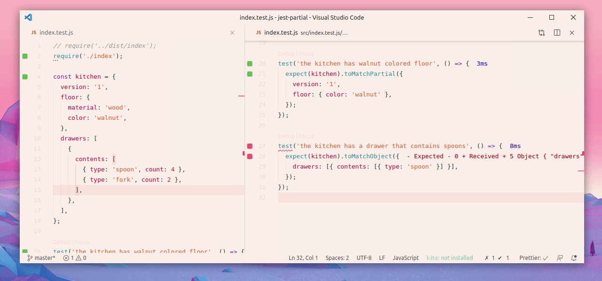

# jest-partial

<!-- ALL-CONTRIBUTORS-BADGE:START - Do not remove or modify this section -->

[](#contributors-)

<!-- ALL-CONTRIBUTORS-BADGE:END -->

**Partial Matcher for Jest Expect**



`jest-partial` asserts that the `provided` object is a subset of the `expected`. We don't always want to verify the entire object that has been given. We often just
want to protect the properties that we need, and ignore everything else.

## Installation

With npm:

```sh
npm install --save-dev jest-partial
```

With yarn:

```sh
yarn add -D jest-partial
```

## Setup

### Jest >v24

Add `jest-partial` to your Jest `setupFilesAfterEnv` configuration. [See for help](https://jestjs.io/docs/en/configuration.html#setupfilesafterenv-array)

```json
"jest": {
  "setupFilesAfterEnv": ["jest-partial"]
}
```

### Jest <v23

```json
"jest": {
  "setupTestFrameworkScriptFile": "jest-partial"
}
```

If you are already using another test framework, like [jest-chain](https://github.com/mattphillips/jest-chain), then you should create a test setup file and `require` each of the frameworks you are using.

For example:

```js
// ./testSetup.js
require('jest-partial');
require('jest-chain');
require('any other test framework libraries you are using');
```

Then in your Jest config:

```json
"jest": {
  "setupTestFrameworkScriptFile": "./testSetup.js"
}
```

### Typescript

If your editor does not recognise the custom `jest-partial` matchers, add a `global.d.ts` file to your project with:

```ts
import 'jest-partial';
```

## API

The examples below use the following data object:

```js
const kitchen = {
  version: '1',
  floor: {
    material: 'wood',
    color: 'walnut',
  },
  drawers: [
    {
      contents: [
        { type: 'spoon', count: 4 },
        { type: 'fork', count: 2 },
      ],
    },
  ],
};
```

#### .toMatchPartial(object)

**case**:
_Our kitchen has multiple drawers, and we just want to know that there is at least one drawer that contains spoons._

```js
expect(kitchen).toMatchPartial({
  drawers: [
    {
      contents: [{ type: 'spoon' }],
    },
  ],
});
```

**case**:
_Our kitchen has multiple drawers, and we want to know that there is a drawer that holds 2 forks._

```js
expect(kitchen).toMatchPartial({
  drawers: [
    {
      contents: [{ type: 'fork', count: 2 }],
    },
  ],
});
```

**case**:
_Our kitchen has multiple drawers, and we want to know that there is a drawer that holds forks and spoons._

```js
expect(kitchen).toMatchPartial({
  drawers: [
    {
      contents: [{ type: 'fork' }, { type: 'spoon' }],
    },
  ],
});
```

## Contributors ✨

Thanks goes to these wonderful people ([emoji key](https://allcontributors.org/docs/en/emoji-key)):

<!-- ALL-CONTRIBUTORS-LIST:START - Do not remove or modify this section -->
<!-- prettier-ignore-start -->
<!-- markdownlint-disable -->
<table>
  <tr>
    <td align="center"><a href="https://github.com/smeijer"><br /><sub><b>Stephan Meijer</b></sub></a><br /><a href="#ideas-smeijer" title="Ideas, Planning, & Feedback">🤔</a> <a href="https://github.com/smeijer/jest-partial/commits?author=smeijer" title="Code">💻</a> <a href="#infra-smeijer" title="Infrastructure (Hosting, Build-Tools, etc)">🚇</a> <a href="#maintenance-smeijer" title="Maintenance">🚧</a></td>
  </tr>
</table>

<!-- markdownlint-enable -->
<!-- prettier-ignore-end -->

<!-- ALL-CONTRIBUTORS-LIST:END -->

This project follows the [all-contributors](https://github.com/all-contributors/all-contributors) specification. Contributions of any kind welcome!
